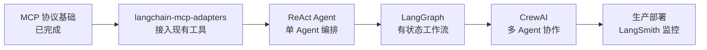

# AI Agent 学习路线：MCP + LangChain + CrewAI

## 概述

本文档整理了基于 MCP 工具集成 + LangChain 编排 + CrewAI 多 Agent 协作的学习路线，结合当前项目已有的 MCP Server 基础，逐步构建完整的 AI Agent 能力栈。

## 技术栈定位

| 层级 | 技术 | 职责 |
|------|------|------|
| 工具层 | MCP (FastMCP) | 将外部系统能力（MySQL、SSH、Wiki、Redmine）标准化暴露为工具 |
| 编排层 | LangChain / LangGraph | 单 Agent 的推理、工具调用、状态管理 |
| 协作层 | CrewAI | 多 Agent 角色分工、任务分配、协作流程 |

## 阶段一：MCP 工具集成（已完成）

当前项目已具备 MCP Server 基础，包括 MySQL 查询、SSH 远程操作、Confluence Wiki、Redmine 项目管理四个 MCP Server。

### 核心资源

- 官方协议规范：[https://modelcontextprotocol.io](https://modelcontextprotocol.io)
- Python SDK：[https://github.com/modelcontextprotocol/python-sdk](https://github.com/modelcontextprotocol/python-sdk)
- FastMCP 文档：Python SDK 内置，`mcp.server.fastmcp.FastMCP`

### 学习要点

- MCP 协议基础：JSON-RPC over stdio，Tool / Resource / Prompt 三大原语
- FastMCP 装饰器用法：`@mcp.tool()` 定义工具函数
- 环境变量配置与 `mcp.json` 声明


## 阶段二：LangChain + MCP 集成

将已有的 MCP Server 工具接入 LangChain Agent，实现单 Agent 的智能编排。

### 核心资源

| 资源 | 链接 |
|------|------|
| LangChain MCP 官方文档 | [https://docs.langchain.com/oss/python/langchain/mcp](https://docs.langchain.com/oss/python/langchain/mcp) |
| langchain-mcp-adapters 库 | [https://github.com/langchain-ai/langchain-mcp-adapters](https://github.com/langchain-ai/langchain-mcp-adapters) |
| LangGraph 教程 | [https://langchain-ai.github.io/langgraph/tutorials/](https://langchain-ai.github.io/langgraph/tutorials/) |
| 实战参考：MCP + ReAct | [https://medium.com/@h1deya/supercharging-langchain-integrating-450-mcp-with-react-d4e467cbf41a](https://medium.com/@h1deya/supercharging-langchain-integrating-450-mcp-with-react-d4e467cbf41a) |

### 学习要点

1. **langchain-mcp-adapters**：几行代码将 MCP Server 工具转为 LangChain Tool
2. **ReAct Agent**：推理-行动循环，Agent 自主决定调用哪个工具
3. **LangGraph**：有状态的 Agent 工作流，支持条件分支、循环、人工审批节点
4. **Memory**：对话记忆与长期记忆管理

### 快速上手示例

```python
from langchain_mcp_adapters.client import MultiServerMCPClient
from langgraph.prebuilt import create_react_agent
from langchain_openai import ChatOpenAI

# 连接已有的 MCP Server
async with MultiServerMCPClient(
    {
        "mysql": {"command": "python", "args": ["-u", "mcp_server/mcp_mysql.py"], "env": {...}},
        "ssh": {"command": "python", "args": ["-u", "mcp_server/mcp_ssh_remote.py"], "env": {...}},
    }
) as client:
    tools = client.get_tools()
    agent = create_react_agent(ChatOpenAI(model="gpt-4o"), tools)
    result = await agent.ainvoke({"messages": [{"role": "user", "content": "查询数据库中的用户表结构"}]})
```

## 阶段三：CrewAI 多 Agent 协作

在 LangChain 单 Agent 基础上，引入 CrewAI 实现多 Agent 角色分工与协作。

### 核心资源

| 资源 | 链接 |
|------|------|
| CrewAI 官方文档 | [https://docs.crewai.com](https://docs.crewai.com) |
| CrewAI 示例仓库 | [https://github.com/crewAIInc/crewAI-examples](https://github.com/crewAIInc/crewAI-examples) |
| CrewAI Tools（含 MCP 支持） | [https://github.com/crewAIInc/crewAI-tools](https://github.com/crewAIInc/crewAI-tools) |
| CrewAI 社区 | [https://community.crewai.com](https://community.crewai.com) |

### 学习要点

1. **Agent 角色定义**：为每个 Agent 设定角色（role）、目标（goal）、背景（backstory）
2. **Task 任务编排**：定义任务依赖关系和执行顺序
3. **MCP 工具接入**：crewai-tools 0.42+ 原生支持 MCP Server 工具发现
4. **Process 模式**：sequential（顺序执行）vs hierarchical（层级管理）

### 结合当前项目的多 Agent 场景示例

```
Agent 1: Redmine 分析师
  - 角色：查询 Redmine issue，分析 Bug 分布
  - 工具：redmine MCP Server

Agent 2: 代码审查员
  - 角色：读取源码，定位问题代码
  - 工具：ssh-remote MCP Server

Agent 3: 文档撰写员
  - 角色：根据分析结果生成技术文档
  - 工具：confluence-wiki MCP Server
```

## 阶段四：进阶方向

### LangGraph 高级编排

- 条件路由：根据 Agent 输出动态选择下一步
- 人工审批节点：关键操作前等待人工确认
- 子图复用：将常用工作流封装为可复用子图
- 文档：[https://langchain-ai.github.io/langgraph/](https://langchain-ai.github.io/langgraph/)

### 其他值得关注的框架

| 框架 | 链接 | 特点 |
|------|------|------|
| OpenAI Agents SDK | [https://github.com/openai/openai-agents-python](https://github.com/openai/openai-agents-python) | OpenAI 官方，轻量，delegation 模式 |
| AutoGen | [https://github.com/microsoft/autogen](https://github.com/microsoft/autogen) | 微软出品，多 Agent 对话，企业级 |
| Agno | [https://github.com/agno-agi/agno](https://github.com/agno-agi/agno) | 极简代码量，快速原型 |

## 推荐学习顺序



## 环境准备

```bash
# 基础依赖
pip install langchain langchain-openai langgraph langchain-mcp-adapters

# CrewAI
pip install crewai crewai-tools

# MCP SDK（已有）
pip install mcp
```
