# ConfigHub + Node Proxy Service 概要设计

## 1. 总体架构

### 1.1 系统定位

面向工业领域的节点集中管理平台。ConfigHub 作为中心管控端，管理分布在各现场的 Node 节点。每个 Node 运行一个轻量级 Proxy Service，负责与 ConfigHub 通信、上报状态、接收指令。ConfigHub 集成 LLM 能力，支持 AI 驱动的智能运维。

### 1.2 架构总览

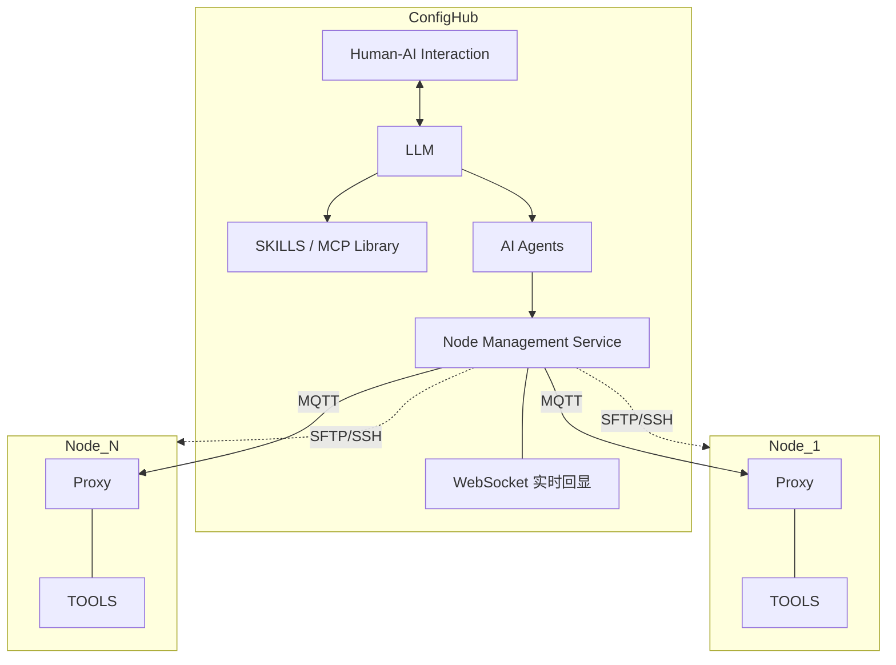

### 1.3 技术选型

| 组件 | 选型 | 约束 | 优点 |
|------|------|------|------|
| ConfigHub | Java / Spring Boot 1.5.x | JDK 1.8.0_211 | — |
| Node Proxy | C++ | C++11, CMake 2.8.12.2 | 轻量，跨平台（ARM/x86） |
| 节点通信 | MQTT (Mosquitto) | 1.6+ | 长连接低延迟，内置心跳/QoS/遗嘱消息，发布订阅适配一对多，TLS 加密，穿越 NAT 友好，断线自动重连 |
| 管理接口 | HTTPS | TLS | 标准 REST，TLS 加密 + 证书认证 |
| 数据库 | SQLite | 3.x | 嵌入式零运维，单文件备份，无需独立进程 |
| 实时回显 | WebSocket | — | SSH 终端/部署日志等流式场景实时回显，WSS 加密 |

---

## 2. ConfigHub（中心管控端）

### 2.1 功能模块

| 模块 | 职责 |
|------|------|
| Node Management Service | 注册中心、心跳监控、指令下发、包分发管理 |
| Human-AI Interaction | Web 管理界面 + 自然语言对话式运维 |
| LLM 集成层 | 意图解析、Agent 调度 |
| AI Agents | 核心智能能力（见 2.6） |
| SKILLS / MCP Library | SSH/SFTP MCP、SCADA 场景技能（工艺规范驱动） |
| 拓扑管理 | 节点信息入库、前端拖拽关联、实时拓扑图 |
| WebSocket 回显 | SSH 终端、部署日志、传输进度、LLM 对话流 |

### 2.2 模块架构

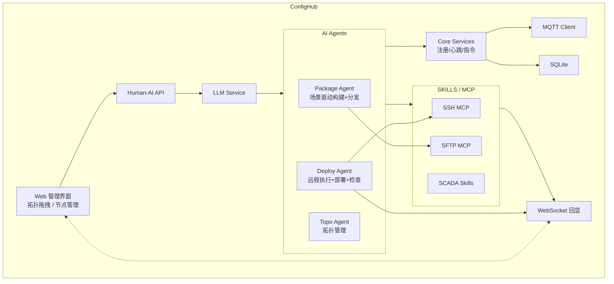

### 2.3 MQTT Topic 设计

| Topic | 方向 | 用途 |
|-------|------|------|
| `hub/register` | Node → Hub | 首次注册申请 |
| `hub/register/resp/{mac}` | Hub → Node | 注册确认下发 |
| `node/{id}/online` | Node → Hub | 上线通知 |
| `node/{id}/heartbeat` | Node → Hub | 心跳 |
| `hub/cmd/{id}` | Hub → Node | 指令下发 |
| `hub/cmd/broadcast` | Hub → Node | 广播指令 |
| `node/{id}/cmd/resp` | Node → Hub | 指令结果 |
| `node/{id}/offline` | Broker | 遗嘱消息 |

### 2.4 HTTPS 管理接口

| 方法 | URL | 说明 |
|------|-----|------|
| GET | `/api/v1/nodes` | 节点列表（含待确认、预注册） |
| GET | `/api/v1/nodes/{node_id}` | 节点详情 |
| POST | `/api/v1/nodes/pre-register` | 预注册设备（设备未通网时提前创建） |
| POST | `/api/v1/nodes/pending/{mac}/approve` | 审核通过 |
| POST | `/api/v1/nodes/pending/{mac}/reject` | 审核拒绝 |
| POST | `/api/v1/nodes/pending/{mac}/bindto/{node_id}` | 关联到预注册设备 |
| DELETE | `/api/v1/nodes/{node_id}` | 注销节点 |
| POST | `/api/v1/nodes/{node_id}/cmd` | 下发指令 |
| GET | `/api/v1/commands` | 指令记录 |
| GET | `/api/v1/packages` | 工程包列表 |
| POST | `/api/v1/packages/upload` | 上传工程包 |
| POST | `/api/v1/packages/{pkg_id}/deploy` | 触发部署 |
| GET | `/api/v1/deploy-records` | 部署记录 |
| GET | `/api/v1/topo` | 获取拓扑数据（节点+关联关系） |
| POST | `/api/v1/topo/edges` | 创建节点关联（拖拽连线） |
| DELETE | `/api/v1/topo/edges/{edge_id}` | 删除节点关联 |
| PUT | `/api/v1/topo/nodes/{node_id}/position` | 更新节点画布位置 |
| POST | `/api/v1/chat` | LLM 对话 |

### 2.5 WebSocket 端点

| 端点 | 用途 | 生命周期 |
|------|------|---------|
| `/ws/ssh/{node_id}` | SSH 远程终端 | 打开 → 关闭终端 |
| `/ws/deploy/{deploy_id}` | 部署日志流 | 触发 → 完成部署 |
| `/ws/sftp/{transfer_id}` | SFTP 传输进度 | 开始 → 完成传输 |
| `/ws/chat/{session_id}` | LLM 对话流 | 开始 → 结束对话 |

### 2.6 节点注册管理

支持两种注册模式，不设超时（注册需人工介入，可能有滞后）：

| 模式 | 场景 | 流程 |
|------|------|------|
| 主动注册 | 设备已通网 | 节点申请 → 入库 pending → 管理员 approve → 下发 node_id |
| 预注册+关联 | 设备暂未通网 | 管理员预创建 → 设备通网后申请 → 管理员 bindto 关联 |

#### 主动注册时序

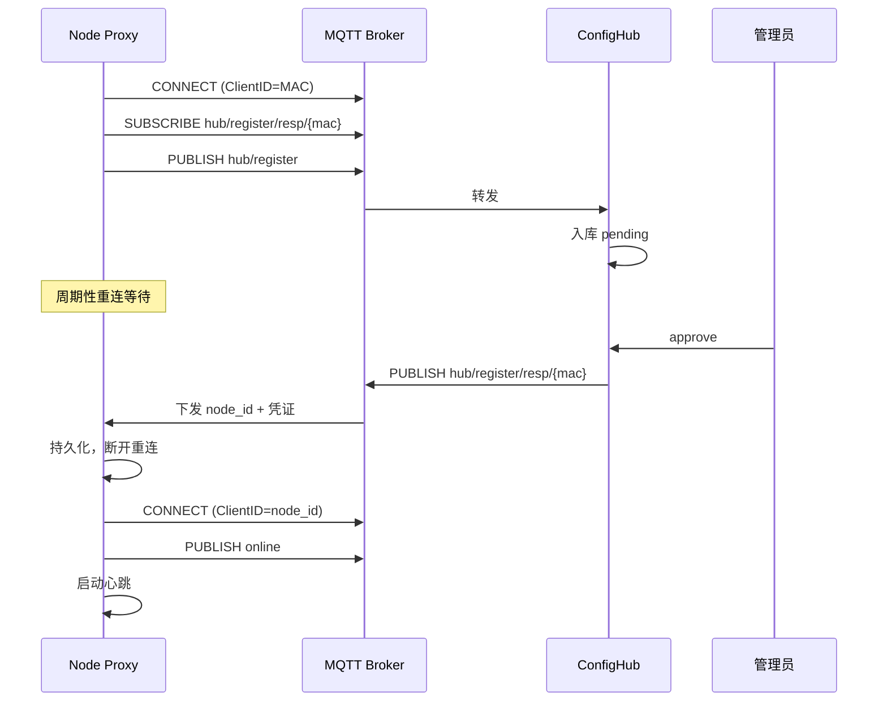

#### 预注册+关联时序

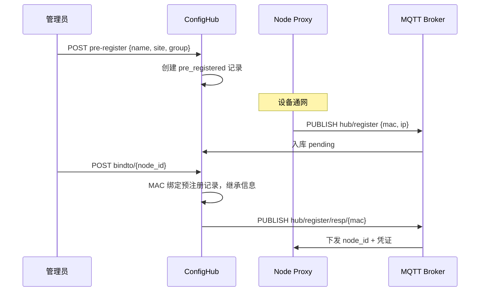

### 2.7 AI Agent 核心能力

#### 能力一：场景驱动工程包构建与分发

Package Agent 根据场景需求（风电/光伏/储能），结合 SKILL 工艺规范，自动生成专属工程包，并调度 SFTP MCP 分发至目标节点。

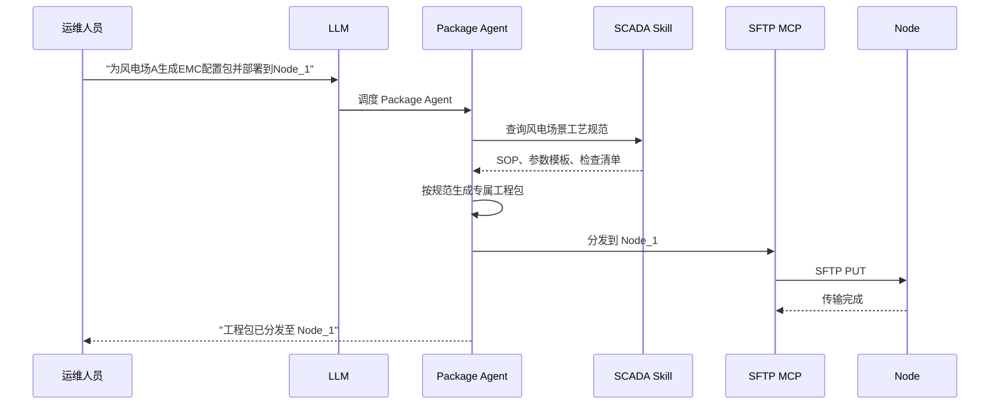

#### 能力二：远程执行、部署与检查（实时回显）

Deploy Agent 调度 SSH MCP 连接目标节点，按照 SKILL 工艺规范执行部署脚本、运行检查项，全程通过 WebSocket 实时回显输出。

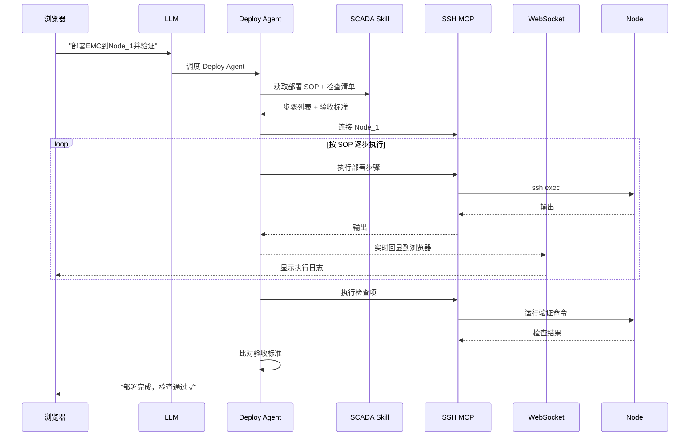

#### 能力三：拓扑管理

节点上报心跳时，ConfigHub 入库节点信息（IP、状态、负载等）。前端提供可视化拓扑画布，支持拖拽节点建立关联关系，实时生成拓扑图。

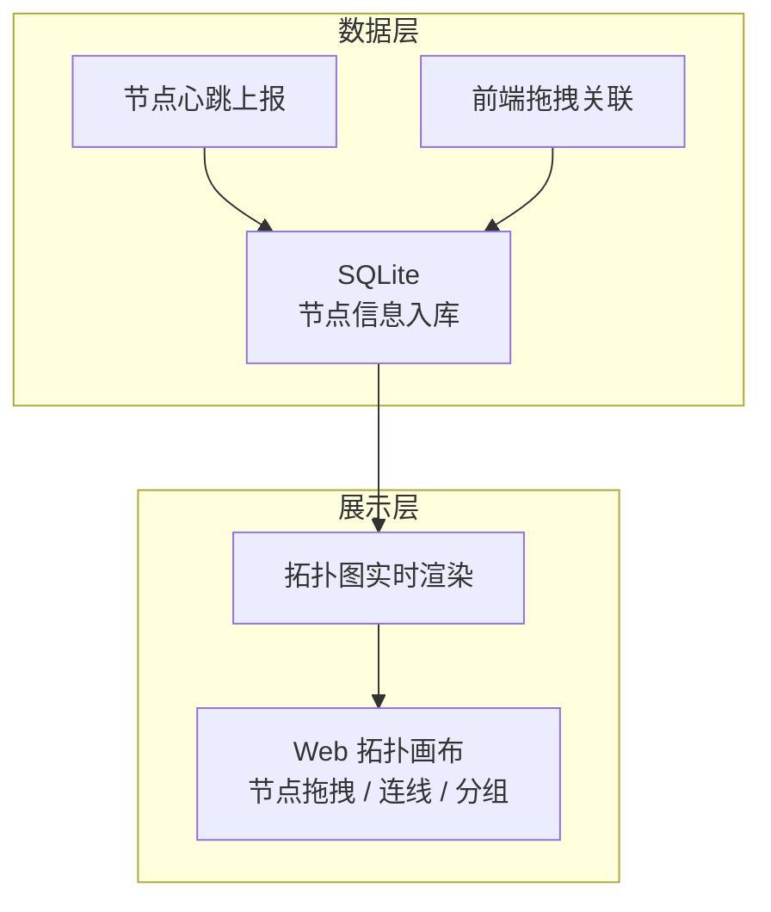

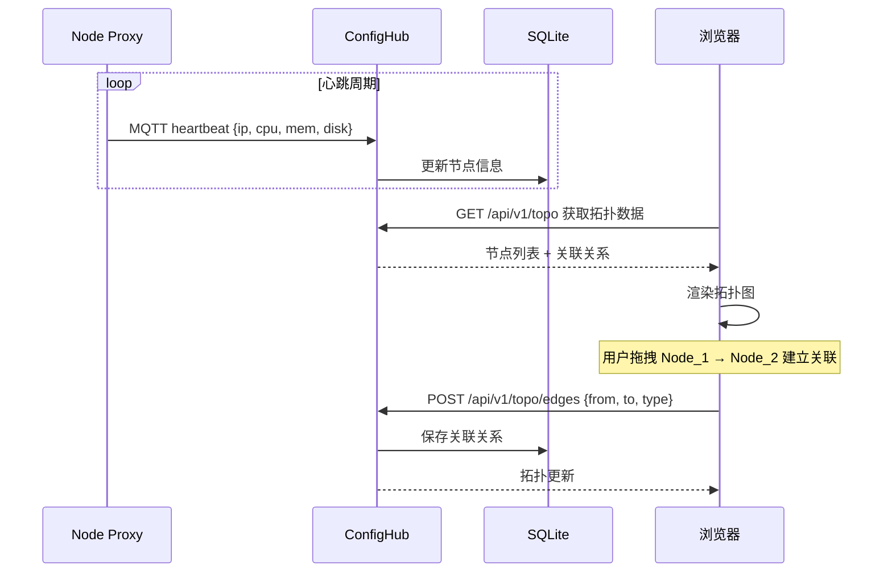

### 2.8 其他业务流程

#### 指令下发

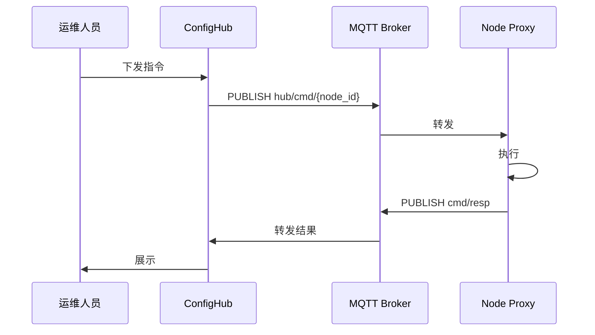

## 3. Node Proxy Service（节点代理端）

### 3.1 定位

轻量级 C++ 守护进程，运行在每个 Node 上，是 ConfigHub 与本地 TOOLS 的桥梁。

### 3.2 职责

| 职责 | 说明 |
|------|------|
| 注册 | 首次启动申请注册，等待人工审核 |
| 心跳 | 周期性上报节点负载（CPU/内存/磁盘） |
| 指令执行 | 接收 Hub 指令，调度本地 TOOLS |
| SFTP/SSH 配合 | 配合包分发和远程执行 |

### 3.3 模块划分

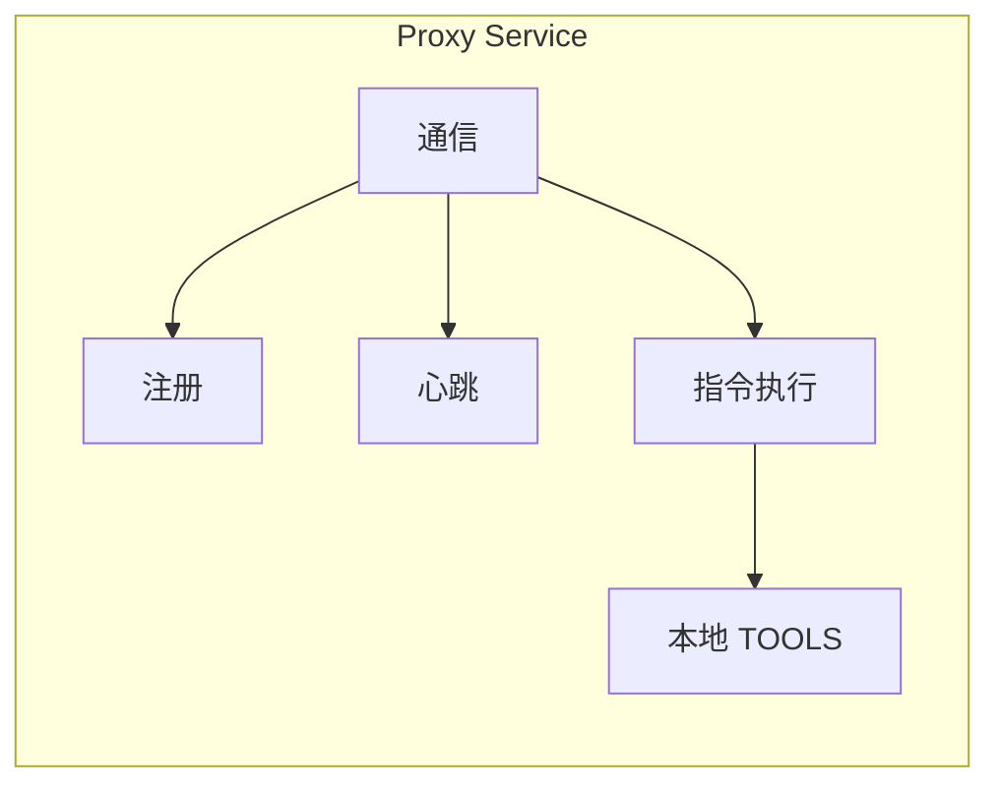

### 3.4 启动逻辑

设备启动统一入口，先检查本地是否已有注册信息。

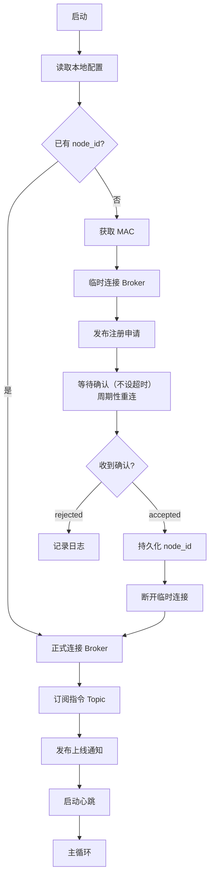

### 3.5 消息报文

所有 MQTT 消息 JSON 格式，UTF-8 编码。

#### 注册申请（Node → Hub）

Topic: `hub/register`

<details>
<summary>报文格式</summary>

```json
{
  "msg_type": "register_request",
  "mac": "AA:BB:CC:DD:EE:01",
  "node_name": "风电场A-1号机组",
  "ip": "192.168.10.101",
  "ssh_port": 22,
  "os": "Linux 3.10.0 x86_64",
  "proxy_version": "1.0.0",
  "timestamp": 1711440000
}
```

</details>

#### 注册确认（Hub → Node）

Topic: `hub/register/resp/{mac}`

<details>
<summary>报文格式</summary>

```json
{
  "msg_type": "register_response",
  "status": "accepted",
  "node_id": "node_001",
  "mqtt_credentials": {"username": "node_001", "password": "xxx"},
  "config": {"heartbeat_interval": 30, "log_level": "INFO"},
  "timestamp": 1711440001
}
```

status: `accepted` | `rejected`

</details>

#### 上线通知（Node → Hub）

Topic: `node/{node_id}/online`

<details>
<summary>报文格式</summary>

```json
{
  "msg_type": "online",
  "node_id": "node_001",
  "ip": "192.168.10.101",
  "proxy_version": "1.0.0",
  "timestamp": 1711440000
}
```

</details>

#### 心跳（Node → Hub）

Topic: `node/{node_id}/heartbeat`

<details>
<summary>报文格式</summary>

```json
{
  "msg_type": "heartbeat",
  "node_id": "node_001",
  "cpu_usage": 23.5,
  "mem_usage": 61.2,
  "disk_usage": 45.0,
  "uptime_sec": 86400,
  "timestamp": 1711440030
}
```

</details>

#### 指令下发（Hub → Node）

Topic: `hub/cmd/{node_id}`

支持的 action: `restart_tool` / `stop_tool` / `start_tool` / `update_config` / `collect_log` / `exec_shell` / `prepare_deploy`

<details>
<summary>报文格式</summary>

```json
{
  "msg_type": "command",
  "cmd_id": "cmd_20260326_002",
  "action": "restart_tool",
  "params": {"tool_name": "EMC", "force": false},
  "timeout_sec": 60,
  "timestamp": 1711440100
}
```

</details>

#### 指令结果（Node → Hub）

Topic: `node/{node_id}/cmd/resp`

<details>
<summary>报文格式</summary>

```json
{
  "msg_type": "cmd_response",
  "cmd_id": "cmd_20260326_002",
  "node_id": "node_001",
  "status": "success",
  "result": {"tool_name": "EMC", "new_pid": 2345},
  "duration_ms": 3200,
  "timestamp": 1711440103
}
```

status: `success` | `failed` | `timeout` | `rejected`

</details>

#### 离线（遗嘱消息）

Topic: `node/{node_id}/offline`（Broker 自动发布）

<details>
<summary>报文格式</summary>

```json
{"msg_type": "offline", "node_id": "node_001", "timestamp": 0}
```

</details>

---

## 4. 部署与运维

### 4.1 部署架构

单节点部署，ConfigHub + Mosquitto 同机，SQLite 嵌入式。

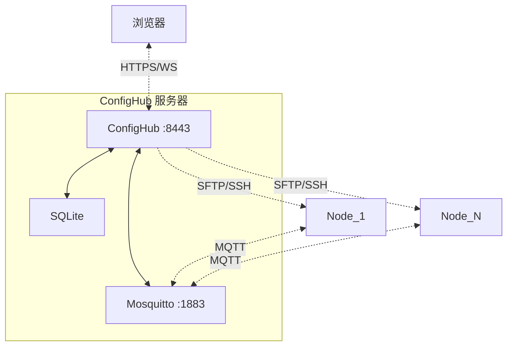

### 4.2 端口规划

| 端口 | 服务 |
|------|------|
| 8443 | ConfigHub（HTTPS + WebSocket） |
| 1883 | Mosquitto MQTT（内网） |
| 8883 | Mosquitto MQTT over TLS（跨网段） |

### 4.3 安全设计

| 层面 | 措施 |
|------|------|
| 传输加密 | MQTT over TLS、HTTPS、SFTP/SSH |
| 身份认证 | MQTT 用户名密码 + 客户端证书 |
| 权限控制 | Topic ACL，节点只能操作自己的 Topic |
| 注册审核 | 首次注册需管理员人工确认 |
| 指令审计 | 所有指令入库，关键操作需确认 |
| 包完整性 | SHA256 校验 |

### 4.4 性能参数

| 指标 | 参考值 |
|------|--------|
| 最大节点数 | 500 |
| 心跳周期 | 30s（可配置） |
| 离线判定 | 90s |
| 指令延迟 | < 500ms |
| 指令超时 | 60s（可配置） |
| ConfigHub 内存 | ~512 MB |
| Proxy 内存 | ~10 MB |
| 数据库 | ~100 MB/年 |

---

## 5. 后续规划

| 阶段 | 内容 | 周期 |
|------|------|------|
| Phase 1 | Proxy 框架 + MQTT + 注册/心跳 | 3 周 |
| Phase 2 | ConfigHub 核心 + 指令 + Web 界面 | 4 周 |
| Phase 3 | SFTP 包分发 + SSH 远程执行 | 2 周 |
| Phase 4 | LLM + AI Agent | 4 周 |
| Phase 5 | SKILL 体系建设 | 持续迭代 |
